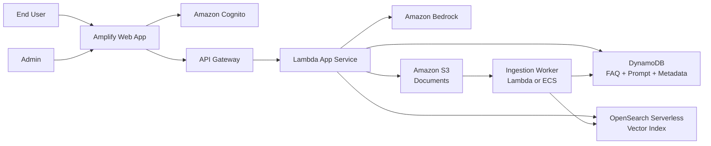

# Phase 1 Architecture

## Business use case

An internal enterprise assistant for HR and IT support.

The system supports two answer modes:
- FAQ mode: If the question matches a managed FAQ, return the admin-defined answer.
- RAG mode: If no FAQ matches, retrieve relevant document chunks and ask the LLM to answer from those documents.

## Users

- Admin
  - manages FAQ
  - uploads documents
  - edits system prompt
- End user
  - asks HR/IT questions
  - sees cited sources when documents are used
  - downloads source documents

## Non-goals for Phase 1

- approval workflow for prompt changes
- document-level permission filtering
- answer quality evaluation dashboards
- rollback/versioning workflow
- advanced multi-tenant design

## High-level architecture

## Authentication and access control

Use Amazon Cognito for application login with email and password.

Use Cognito groups:
- `admins`
- `users`

Frontend behavior:
- users see the chat page
- admins see chat page plus admin console

Backend authorization:
- API Gateway authorizer validates Cognito tokens
- Lambda checks user group claims before allowing admin actions

Why not IAM user login:
- IAM users are not meant for normal app login
- storing business users in IAM is hard to manage and risky
- Cognito is the correct AWS service for this requirement

## Core components

### 1. Frontend

Hosted with AWS Amplify.

Pages:
- `/login`
- `/chat`
- `/admin/faqs`
- `/admin/documents`
- `/admin/prompt`

### 2. FAQ service

Stored in DynamoDB.

Simple FAQ record:
- `faq_id`
- `question`
- `answer`
- `tags`
- `updated_at`

Matching approach for Phase 1:
- basic semantic or keyword match in app logic
- if strong FAQ match exists, return FAQ answer directly

### 3. Prompt configuration

Stored in DynamoDB as a singleton config item.

Fields:
- `config_id`
- `system_prompt`
- `updated_at`
- `updated_by`

### 4. Document ingestion

Admin uploads files to S3.

S3 upload triggers ingestion worker:
1. read document
2. extract text
3. chunk text
4. create embeddings
5. store vectors in OpenSearch Serverless
6. store metadata in DynamoDB

Phase 1 supported types:
- `.txt`
- `.md`
- `.pdf` later if extraction is added cleanly

### 5. RAG query flow

When user asks a question:
1. API receives question.
2. App checks FAQ first.
3. If no strong FAQ match, generate query embedding.
4. Search OpenSearch vector index.
5. Build prompt with:
   - system prompt from admin config
   - user question
   - top matching chunks
6. Call Bedrock model.
7. Return answer with source list.

### 6. Source download

Return S3 pre-signed URLs for cited documents.

This keeps document access simple in Phase 1.

## Data model

### DynamoDB tables

`faq_entries`
- `faq_id` (PK)
- `question`
- `answer`
- `tags`
- `updated_at`

`app_config`
- `config_id` (PK)
- `system_prompt`
- `updated_at`
- `updated_by`

`documents`
- `document_id` (PK)
- `file_name`
- `s3_key`
- `status`
- `uploaded_at`
- `uploaded_by`
- `chunk_count`

## API sketch

### User APIs

- `POST /chat/ask`
  - request: `question`
  - response:
    - `answer`
    - `mode` = `faq | rag`
    - `sources[]`

### Admin APIs

- `GET /admin/faqs`
- `POST /admin/faqs`
- `PUT /admin/faqs/{faqId}`
- `DELETE /admin/faqs/{faqId}`
- `GET /admin/prompt`
- `PUT /admin/prompt`
- `POST /admin/documents/upload-url`
- `GET /admin/documents`

## Simple operational posture

Keep Phase 1 simple:
- one AWS account or one sandbox environment
- basic CloudWatch logs
- IaC from day one
- no complicated approval workflow

## Deferred to Phase 2

- answer evaluation
- guardrails and prompt versioning
- document permission filtering
- feedback loop
- richer observability
- stronger ingestion orchestration
